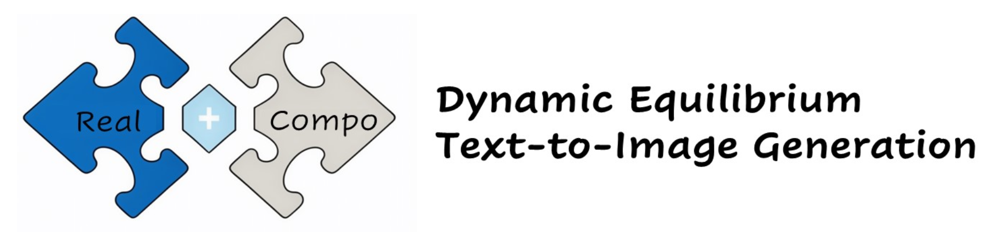
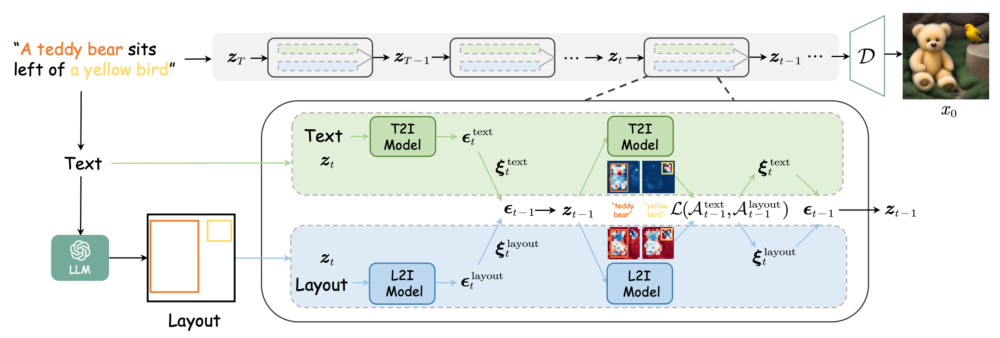
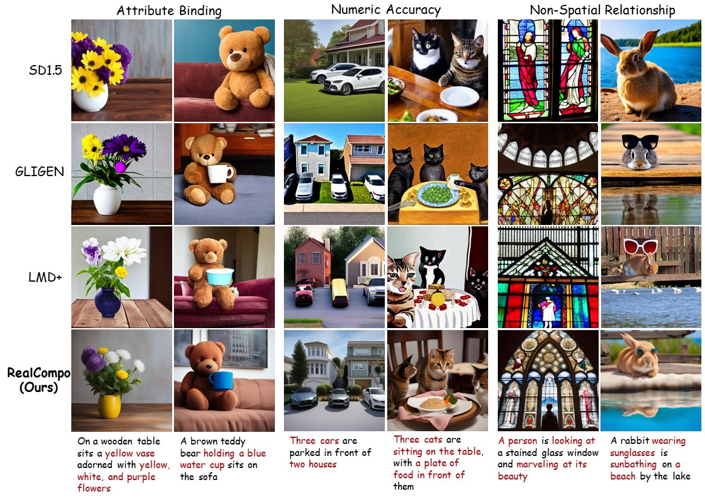
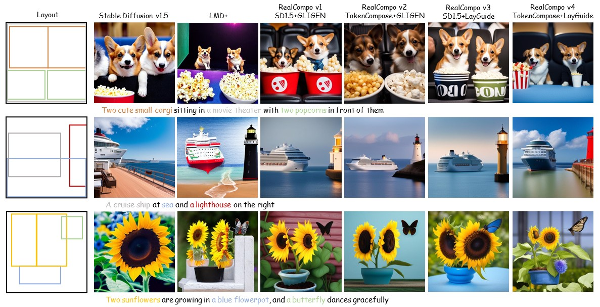

# 

This repository contains the official implementation of our [RealCompo]().

>[**RealCompo: Dynamic Equilibrium between Realism and Compositionality Improves Text-to-Image Diffusion Models**]()    
>[Xinchen Zhang\*](https://cominclip.github.io/), 
>[Ling Yang\*](https://yangling0818.github.io/), 
>[Yaqi Cai](https://github.com/CCYaqi),
>[Zhaochen Yu](https://github.com/BitCodingWalkin), 
>[Jiake Xie](https://scholar.google.com/citations?hl=zh-CN&user=pD8wUxgAAAAJ),
>[Ye Tian](https://github.com/tyfeld),
>[Minkai Xu](https://minkaixu.com/),
>[Yong Tang](https://scholar.google.com/citations?user=ubVWrRwAAAAJ&hl=en), 
>[Yujiu Yang](https://sites.google.com/view/iigroup-thu/about), 
>[Bin Cui](https://cuibinpku.github.io/) 
><br>**Tsinghua University, Peking University, University of Science and Technology of China, PicUp.AI, Stanford University**<br>

<details>
    <summary>Click for full abstract</summary>
Diffusion models have achieved remarkable advancements in text-to-image generation. However, existing models still have many difficulties when faced with multiple-object compositional generation. In this paper, we propose a new training-free and transferred-friendly text-to-image generation framework, namely RealCompo, which aims to leverage the advantages of text-to-image and layout-to-image models to enhance both realism and compositionality of the generated images. An intuitive and novel balancer is proposed to dynamically balance the strengths of the two models in denoising process, allowing plug-and-play use of any model without extra training. Extensive experiments show that our RealCompo consistently outperforms state-of-the-art text-to-image models and layout-to-image models in multiple-object compositional generation while keeping satisfactory realism and compositionality of the generated images.
</details>

## Introduction



We introduce a new training-free and transferred-friendly text-to-image generation framework RealCompo that utilizes a novel balancer to achieve dynamic equilibrium between realism and compositionality in generated images.

## New Updates

**[2024.2]** Our main code of RealCompo v1 is released.

## Gallery

<table class="center">
    <tr>
    <td width=100% style="border: none"></td>
    </tr>
    <tr>
    <td width="100%" style="border: none; text-align: center; word-wrap: break-word">Qualitative comparison between our RealCompo and the outstanding text-to-image model Stable Diffusion v1.5, as well as the layout-to-image models, GLIGEN and LMD+. Colored text denotes the advantages of RealCompo in generating results.
</td>
  </tr>
</table>

<table class="center">
    <tr>
    <td width=100% style="border: none"></td>
    </tr>
    <tr>
    <td width="100%" style="border: none; text-align: center; word-wrap: break-word">Qualitative comparison of RealCompo's generalization to different models: We select two T2I models: Stable Diffusion v1.5, TokenCompose, two L2I models GLIGEN, Layout Guidance (LayGuide), and combine them in pairs to obtain four versions of RealCompo. We demonstrate that RealCompo has strong generalization and generality to different models, achieving a remarkable level of both fidelity and precision in aligning with text prompts.
</td>
  </tr>
</table>

## Installation

```shell
git clone https://github.com/YangLing0818/RealCompo
cd RealCompo
conda create -n RealCompo python==3.8.10
conda activate RealCompo
pip install -r requirements.txt
```

## Download models

We provide the code of RealCompo v1, which is composed of Stable Diffusion v1.5 and GLIGEN.

You should download the checkpoints of GLIGEN ([HF Hub](https://huggingface.co/gligen/gligen-generation-text-box/blob/main/diffusion_pytorch_model.bin)) put its path into  `inference.py`.

## Inference: Generate images with RealCompo v1

### Option 1: Use LLMs to reason out the layout

You can get the results through running: 

```bash
python inference.py --user_prompt 'a teddy bear sits left of a yellow bird' --api_key 'put your api_key here' 
```

**--user_prompt** is the original prompt that used to generate a image.

**--api_key** is needed if you use GPT-4.

**You can also use local LLMs to reason out layouts**. Example samples will be saved in `generation_samples`. You can check `inference.py` for more details about interface. 

```
generation_samples
├── generation_realcompo_v1_sd_gligen_a_teddy_bear_sits_left_of_a_yellow_bird
│   ├── 0.png
│   ├── 1.png
|   .....
......
```

### Option 2: Manually setting the layout

If you already have the layouts related to all objects, you can directly run:

```bash
python inference.py  --no_gpt --user_prompt 'a teddy bear sits left of a yellow bird' --object "['a teddy bear', 'a yellow bird']" --boundingbox "[[0.1, 0.1, 0.7, 0.9], [0.7, 0.1, 0.9, 0.4]]" --token_location "[3, 9]"
```

**--no_gpt** can be used when you have already obtained the layout.

**--object** represents the set of objects mentioned in the prompt.

**--boundingbox** represents the set of layout for each object.

**--token_location** represents the set of locations where each object appears in the prompt.


You can change the backbone of the T2I model to Stable Diffusion v1.4, TokenCompose, and so on. 

The core code for updating the models' coefficients is located in `ldm/models/diffusion/plms.py`. Using this code, you can make slight modifications to replace the L2I model with another one.


## Citation

```
@article{zhang2024realcompo,
  author    = {Zhang, Xinchen and Yang, Ling and Cai, Yaqi and Yu, Zhaochen and Xie, Jiake and Tian, Ye and Xu, Minkai and Tang, Yong and Yang, Yujiu and Cui, Bin},
  title     = {RealCompo: Dynamic Equilibrium between Realism and Compositionality Improves Text-to-Image Diffusion Models},
  journal   = {arXiv:24},
  year      = {2024},
}
```
## Acknowledgements

This repo uses some codes from  [GLIGEN](https://github.com/gligen/GLIGEN) and [LLM-groundedDiffusion](https://github.com/TonyLianLong/LLM-groundedDiffusion). Thanks for their wonderful work and codebase! 
